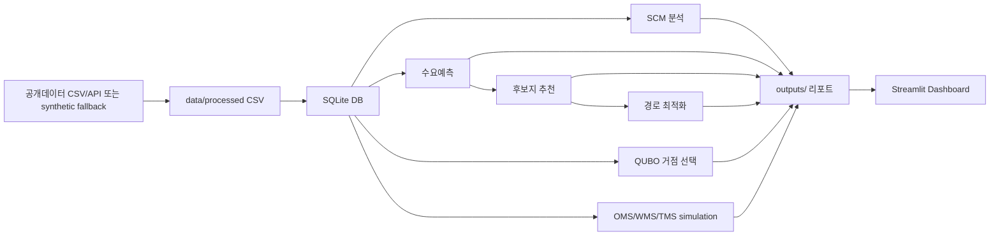

# ParcelFlow AI — 물류 데이터 분석 포트폴리오

ParcelFlow AI는 **공개 생활물류/택배 데이터 + 재현 가능한 시뮬레이션 레이어**를 기반으로,
수요예측부터 추천/최적화까지 하나의 스토리로 연결한 물류 포트폴리오 프로젝트입니다.

> 이 프로젝트의 OMS/WMS/TMS 이벤트 데이터는 실제 기업 내부 원천데이터가 아니라, 공개 집계 데이터를 바탕으로 생성한 simulation 결과입니다.

---

## 1) 프로젝트 소개

이 프로젝트는 “모델 성능”만 보여주는 PoC가 아니라,
**운영 의사결정(재고/배송/SLA/거점)까지 이어지는 물류 분석 포트폴리오**를 목표로 합니다.

핵심 산출물:
- 분석 결과 CSV/리포트 (`outputs/`)
- Streamlit 대시보드 (`dashboard/app.py`)
- 케이스 문서 (`analysis_cases/`)

---

## 2) 해결하려는 물류 문제

생활물류 운영에서 동시에 발생하는 문제를 한 파이프라인으로 다룹니다.

- 수요 변동으로 인한 예측 오차와 운영 불확실성
- 피크 시즌 재고 부족(Stockout) 리스크
- 배송 SLA 지연 리스크와 라스트마일 경로 비효율
- 신규 거점/택배락커 후보지 우선순위 결정

---

## 3) 주요 기능

- **데이터 수집/정제 + DB 적재**
  - 공개데이터 파일 사용 또는 synthetic fallback 생성
  - SQLite 기반 PoC DB 구축
- **SCM 분석**
  - OD 흐름, 지역 변동성, 허브 부하 관련 분석 산출
- **수요예측**
  - 지역×카테고리 일별 예측
  - `seasonal naive` baseline 대비 성능 비교
- **추천 시스템**
  - MFC/택배락커 후보지 스코어링 + 추천 사유 제공
- **최적화 실험**
  - CVRP 휴리스틱(탐욕 + 2-opt)
  - QUBO 기반 거점 선택 실험
- **OMS/WMS/TMS 시뮬레이션 분석**
  - 주문/피킹/배송 이벤트 및 KPI 테이블 생성
- **대시보드 시각화**
  - 운영 KPI/예측/추천/최적화 결과를 탭 형태로 제공

---

## 4) 기술 스택

- **Language**: Python 3.10+
- **Data/ML**: pandas, numpy, scikit-learn, scipy, statsmodels, joblib
- **Visualization/App**: Streamlit, Altair, matplotlib
- **Storage**: SQLite
- **Testing**: pytest

의존성은 `requirements.txt` 기준입니다.

---

## 5) 데이터 흐름



---

## 6) 실행 방법

### 6-1. 환경 준비
```bash
python -m venv .venv
source .venv/bin/activate  # Windows: .venv\Scripts\activate
pip install -r requirements.txt
```

### 6-2. 파이프라인 실행
```bash
python scripts/run_pipeline.py
```

선택: OpenAI 기반 Executive Summary를 함께 생성하려면
```bash
export OPENAI_API_KEY=sk-...   # 따옴표 없이 권장
python scripts/run_pipeline.py
```
> `.env`에 키를 넣는 경우 `OPENAI_API_KEY=sk-...` 형태를 권장합니다.  
> `OPENAI_API_KEY="sk-..."`처럼 따옴표가 있어도 코드에서 자동 정규화합니다.

### 6-3. 테스트 실행
```bash
pytest -q
```

### 6-4. 대시보드 실행
```bash
streamlit run dashboard/app.py
```

### package.json 기준 명령어 안내
- 현재 레포에는 `package.json`이 없습니다.
- 따라서 npm script 기반 실행 명령은 **확인 필요**가 아니라, **해당 없음**입니다.

---

## 7) 핵심 화면 설명 (dashboard/app.py)

- **Executive Impact Summary**
  - 우선순위 액션/핵심 리스크/KPI 요약
- **OMS / WMS / TMS Dashboard**
  - 주문-출고 병목, 재고/피킹 리스크, SLA 지연 리스크 분석
- **Forecasting & Regression**
  - 예측 모델 성능 및 실제 대비 예측 추이
- **Recommendation / Optimization / QUBO**
  - 후보지 추천, 경로 최적화 결과, QUBO 실험 결과 표시

---

## 8) 포트폴리오 관점의 차별점

- **End-to-End 스토리**: 데이터 준비 → 분석 → 예측 → 추천 → 최적화 → 대시보드까지 연결
- **운영 관점 강조**: OMS/WMS/TMS KPI 중심으로 비즈니스 질문에 답하도록 구성
- **설명 가능한 추천**: 점수뿐 아니라 추천 사유를 함께 제공
- **고전적 최적화 + QUBO 병행**: 실무형 baseline과 quantum-ready formulation을 함께 제시
- **재현성 고려**: seed 고정 synthetic 데이터 및 테스트 코드 포함

---

## 9) 향후 개선 계획

- 공개데이터 연결 품질 리포트(매핑 성공률/결측/드롭률) 자동화
- CVRP를 OR-Tools 기반 최적해 비교 구조로 확장
- 추천 모델의 설명력 강화(SHAP/규칙 리포트)
- 대시보드에 데이터 신선도/실행 이력 표시
- 포트폴리오 보고서(비즈니스 임팩트 추정) 자동 생성 고도화

---

## 참고 폴더

- `src/parcelflow/` : 핵심 분석/모델 코드
- `scripts/` : 파이프라인 실행 스크립트
- `dashboard/` : Streamlit 앱
- `analysis_cases/` : 케이스 문서
- `docs/` : 아키텍처/데이터 소스/업무 맥락 문서
- `outputs/` : 산출물
