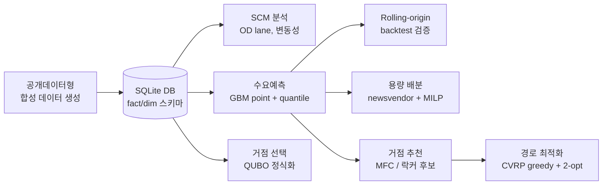
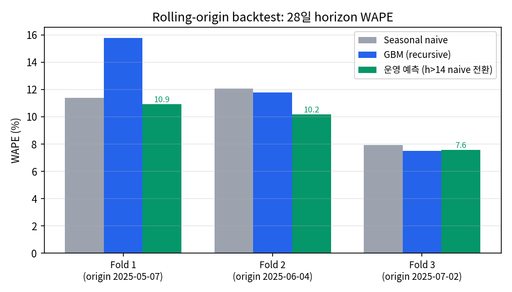
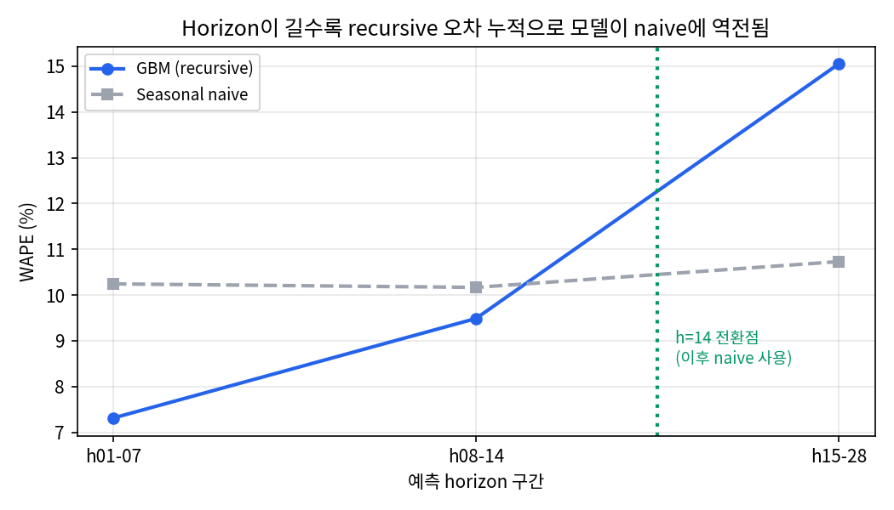
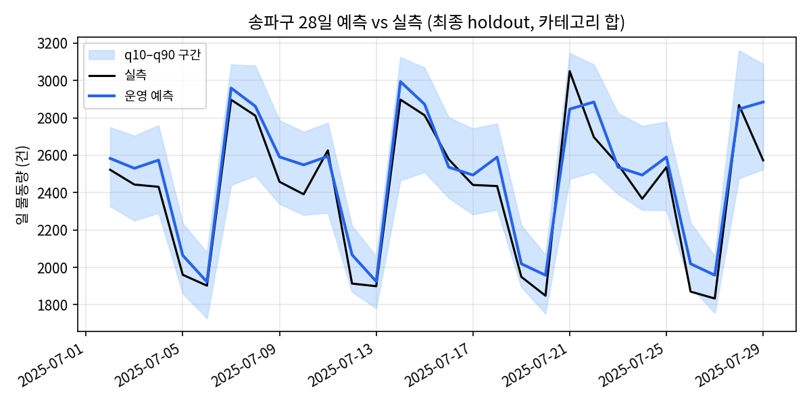
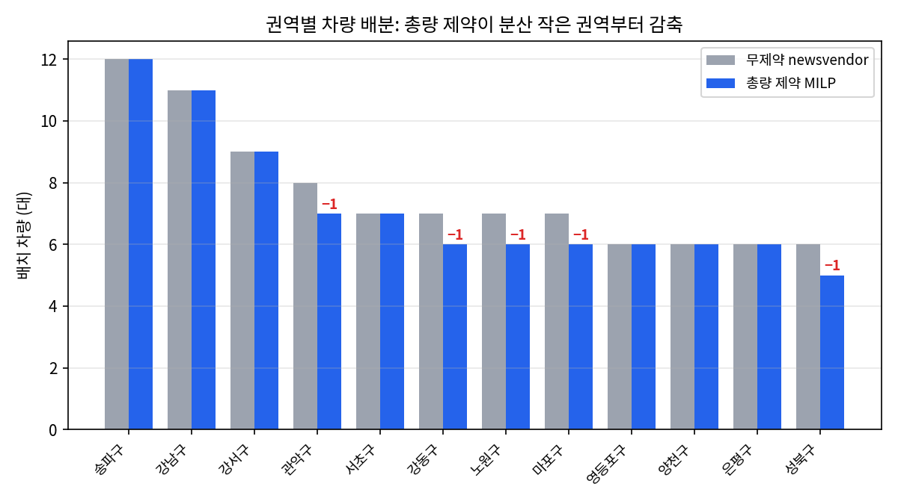
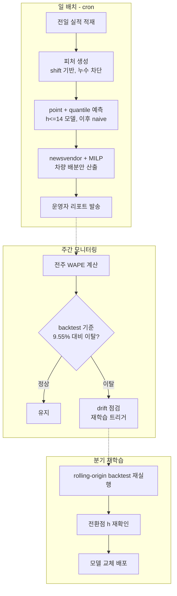

# ParcelFlow: 생활물류 수요예측과 차량 배분 PoC

권역별 택배 수요를 예측하고, 그 예측을 차량 몇 대를 어디에 둘지라는 결정까지 잇는 실행 가능한 파이프라인입니다. 데이터 적재부터 예측, 용량 배분, 거점 추천, 경로와 거점 선택 최적화까지 한 번의 명령으로 재현됩니다.

실제 물류사 내부 데이터는 쓰지 않았습니다. 서울 생활물류 공개데이터와 같은 구조의 합성 데이터를 생성해 파이프라인 전체를 검증하며, 실제 CSV를 확보하면 `data/raw/external/`에 넣어 같은 구조로 연결할 수 있게 설계했습니다.

---

## 1. 분석 배경

물류 운영에서 하루 뒤 물량을 모르면 두 가지 비용이 동시에 발생합니다. 차량을 적게 배치하면 당일 처리 못 한 물량이 지연 배상과 재배송 비용으로 돌아오고, 많이 배치하면 유휴 차량의 고정비가 낭비됩니다. 두 비용은 크기가 다릅니다. 미처리 1건의 손실이 유휴 1건분보다 비쌉니다.

그래서 이 프로젝트의 질문은 "내일 물량이 얼마인가"에서 끝나지 않습니다. **"비용 구조가 비대칭일 때, 예측의 불확실성까지 반영해 권역별로 차량을 몇 대 배치해야 하는가"**까지가 문제입니다. 예측 모델은 이 결정의 입력이고, 성과는 예측 정확도가 아니라 결정의 기대비용으로 판단합니다.

## 2. 파이프라인 전체 흐름



```bash
python -m venv .venv && source .venv/bin/activate
pip install -r requirements.txt
python scripts/run_pipeline.py        # 전체 파이프라인 실행
python scripts/make_readme_charts.py  # README 차트 재생성
```

## 3. 데이터와 전처리

데이터는 `권역(25개 자치구) x 상품군(5개) x 일자(210일)`의 일별 물동량 26,250행이 중심입니다. 권역 메타(인구, 이커머스 지수, 소득 지수), 상품군 메타(신선도, 부피 점수), 달력(요일, 주말, 휴일)이 dimension 테이블로 붙습니다.

전처리에서 지킨 원칙은 하나입니다. **예측 시점에 알 수 없는 값이 피처에 들어가면 안 된다.**

| 단계 | 처리 | 이유 |
|---|---|---|
| 정렬 | 시리즈(권역 x 상품군)별 날짜 오름차순 정렬 후 피처 생성 | lag가 시리즈 경계를 넘어 섞이는 것을 차단 |
| lag/rolling | 전부 `shift(1)` 이후 값만 사용 | 당일 실측이 당일 피처로 새는 것을 차단 |
| 결측 | lag 생성으로 생기는 시리즈 초기 14일 NaN 행은 학습에서 제외 | 값이 없는 게 아니라 이력이 아직 없는 구간이므로 대치가 아니라 제외가 맞음 |
| 음수 | 예측값은 0에서 클리핑 | 물동량은 음수가 될 수 없음 |

합성 데이터라 원천 결측은 없습니다. 실데이터 연결 시에는 수집 누락일(하루 통째 결측)과 부분 결측을 구분해야 하며, 전자는 달력 기준 재색인 후 결측 플래그 피처로, 후자는 시리즈별 직전 주 동일 요일 값으로 대치하는 확장 포인트를 `ingestion_external.py`에 남겨두었습니다.

## 4. 피처 설계와 근거

| 피처 | 무엇을 잡는가 |
|---|---|
| `lag_1, lag_7, lag_14` | 직전일 수준과 주간 주기. 택배 물동량은 요일 패턴이 지배적이라 7일 lag가 핵심 |
| `rolling_7/14_mean` | 최근 수준의 안정화. 단일 lag의 노이즈를 평활 |
| `day_of_week, is_weekend, is_holiday` | 주기와 달력 효과. 휴일은 상품군별로 반대 방향으로 작동(신선식품 증가, 사무용품 감소) |
| `month_sin/cos, dow_sin/cos` | 주기 변수의 순환 인코딩. 12월과 1월, 일요일과 월요일이 숫자상 멀어지는 문제를 제거 |
| `population, ecommerce_index, income_index` | 권역 수요의 수준 차이. 시리즈 125개를 하나의 global model로 학습하므로 시리즈를 구분할 정적 피처가 필요 |
| `perishability, bulky_score` | 상품군 특성. 휴일 x 상품군 상호작용을 트리가 학습할 재료 |

**뺀 피처와 이유**: 전체 기간 경과일(`day_index`)은 제거했습니다. 트리 모델은 학습 범위 밖 값을 외삽하지 못해 미래 구간에서 이 피처가 상수로 작동합니다. 추세 정보는 못 주면서 학습 구간 과적합 위험만 남기 때문입니다.

## 5. 모델 선택: 데이터 특징에서 출발

모델은 Gradient Boosting(point + quantile)입니다. 후보와 비교해 이렇게 판단했습니다.

- **시리즈별 통계 모형(ARIMA 계열)과 비교**: 시리즈가 125개인데 각각 210일로 짧습니다. 시리즈마다 따로 적합하면 개별 이력이 부족하고, 권역 간 공통 패턴(요일 효과, 휴일 효과)을 공유하지 못합니다. 정적 피처를 넣은 global tree model은 짧은 시리즈들이 서로의 학습 데이터가 되어 주는 구조라 이 데이터 규모에 맞습니다.
- **딥러닝 시계열 모델(DeepAR 등)과 비교**: 총 2만 6천 행 규모에서는 과한 용량입니다. 튜닝 비용 대비 이득을 기대하기 어렵고, PoC의 재현성과 해석 가능성(feature importance)이 우선이었습니다.
- **GBM을 확정한 결정적 이유**: quantile loss를 지원해 같은 피처로 q10, q50, q75, q90 예측을 만들 수 있습니다. 6장의 newsvendor 배분은 점 예측이 아니라 수요 분위수를 입력으로 받으므로, 예측과 결정이 한 모델 체계로 이어집니다.

## 6. 평가 설계와 결과

### 지표: 왜 WAPE인가

주 지표는 WAPE(가중 절대 오차율, `sum|오차| / sum|실측|`)입니다. MAPE는 물동량이 작은 시리즈에서 분모가 작아 오차율이 폭발하고, 저수요 권역의 오차가 고수요 권역과 같은 무게로 평균되는 문제가 있습니다. WAPE는 물동량으로 가중되므로 "전체 물량 대비 몇 %를 틀렸나"라는 운영 감각과 일치합니다. MAE, RMSE, sMAPE는 보조 지표로 함께 산출합니다.

### 평가 구조: rolling-origin + recursive multi-step

단일 holdout에 테스트 구간 실측 lag를 넣고 재면 WAPE가 6% 수준으로 나옵니다. 운영 시점에는 미래 실측이 없으므로 이는 1-step 성능을 28일 성능처럼 부풀리는 누수입니다. 이 레포의 평가는 두 가지를 지킵니다.

1. **Rolling-origin backtest**: origin을 28일씩 3번 뒤로 밀며 "그 시점까지 학습, 이후 28일 예측"을 반복합니다. 단일 분할은 특정 기간의 운에 좌우되지만, origin을 옮기면 지표의 분산까지 보입니다. 데이터가 210일로 짧아 오래된 구간을 버리는 sliding 대신 expanding window를 썼습니다.
2. **Recursive multi-step**: 테스트 구간은 예측값을 다시 lag로 되먹여 하루씩 예측합니다. horizon이 길수록 오차가 누적되는 운영 현실이 지표에 그대로 반영됩니다.

### 결과



| 구분 | WAPE (3-fold 평균) |
|---|---|
| Seasonal naive (직전 주 동일 요일) | 10.47% |
| GBM recursive 단독 | 11.68% |
| **운영 예측 (h<=14 모델, 이후 naive 전환)** | **9.55%** |

정직하게 평가하니 모델 단독은 naive에 집니다. horizon별로 분해하면 이유가 보입니다.



14일까지는 모델이 확실히 앞서고(7.3% vs 10.2%), 15일부터 recursive 오차 누적으로 역전됩니다(15.1% vs 10.7%). 그래서 운영 예측은 14일 이후를 naive로 전환하며, 이 정책이 세 fold 전부에서 naive를 이깁니다. 전환점의 근거는 `outputs/forecasting/backtest_by_horizon.csv`로 남깁니다.



Quantile 예측의 empirical coverage는 q10 18.8%, q50 70.5%, q75 87.0%, q90 95.6%로 목표보다 다소 넓게 나옵니다. recursive 경로 조건부 근사의 한계이며, 실운영 전에는 conformal 보정을 검토할 지점입니다.

## 7. 예측을 결정으로: newsvendor와 MILP

예측의 종착지는 권역별 차량 배분입니다. 이 결정은 newsvendor 구조입니다.

- 과소 배치 비용 Cu = 1,500원/건 (미처리 페널티, 가정치)
- 과대 배치 비용 Co = 500원/건분 (유휴 용량 비용, 가정치)
- 최적 서비스 수준 q* = Cu / (Cu + Co) = **0.75**

즉 수요 분포의 75% 분위수만큼 용량을 준비하는 것이 기대비용 최소이며, 그래서 예측 모델이 q75를 직접 출력합니다. 차량 총량에 제약이 걸리면 권역별 독립 계산으로는 못 풀기에, q10/q50/q90 3점 시나리오(Pearson-Tukey 근사)로 기대 부족비용을 선형화한 MILP를 CBC로 풉니다. 부족분을 연속 보조변수로 두면 max(0, x)가 선형화되어 표준 정식화가 됩니다.



무제약 필요 차량 147대에 총량 135대 제약을 걸면, MILP는 시나리오 기대 부족비용이 가장 덜 늘어나는 권역부터 깎습니다. 수요 분산이 작은 권역은 한 대를 빼도 기대 페널티 증가가 작아 먼저 감축됩니다. 권역별 독립 반올림으로는 이 우선순위가 나오지 않습니다.

비용 상수와 대당 처리량(220건/일)은 도메인 가정이므로, 실제 적용 시 지연 배상 단가와 차량 운영비로 재추정해야 합니다.

## 8. 거점 추천과 최적화 모듈

- **거점 추천**: 예측 물동량, 최근 성장률, 변동성, 기존 허브와의 거리를 결합해 마이크로 풀필먼트 센터와 택배락커 후보지를 점수화합니다.
- **경로 최적화(CVRP)**: 용량 기준 bin packing 후 nearest neighbor 초기해를 2-opt로 개선합니다. OR-Tools solver를 붙이면 같은 입력으로 최적해와 휴리스틱해를 비교할 수 있습니다.
- **거점 선택(QUBO)**: 후보 허브 k개 선택을 QUBO로 정식화했습니다. 제약 penalty는 임의 상수가 아니라 위반 이득의 상계에서 유도합니다(`penalty = 2 x max|benefit| + 1`). 개수를 1개 어겨 얻는 목적함수 이득이 최대 max|benefit|이고 penalty 항은 최소 penalty만큼 증가하므로 이 값이면 충분합니다. brute force 검증에서 에너지 상위 해 전원이 제약을 만족하고, QUBO 최적해가 고전 최적해와 일치함을 확인했습니다.

## 9. 운영 시나리오

이 파이프라인은 일 배치로 운영하는 것을 전제로 설계했습니다.



- **일 배치**: 전일 실적 적재 후 예측과 배분안 산출까지 자동. 폐쇄망이면 Docker와 cron 조합으로 동일하게 돌아가는 구조입니다.
- **주간 모니터링**: 실현된 주간 WAPE를 backtest 기준선(9.55%)과 비교합니다. 기준선은 희망치가 아니라 같은 평가 조건에서 나온 수치라 이탈 감지의 근거가 됩니다. quantile coverage도 함께 추적해 분포 자체의 drift를 봅니다.
- **분기 재학습**: 백테스트를 재실행해 naive 전환점(h=14)이 여전히 유효한지부터 확인합니다. 전환점은 상수가 아니라 데이터가 정하는 값입니다.

## 10. 산출물 구조

```text
outputs/
├── scm/                      # OD lane, 권역 변동성, 피크 분석
├── forecasting/
│   ├── forecast_predictions.csv   # point/quantile/naive/운영예측(horizon 전환)
│   ├── backtest_metrics.csv       # rolling-origin fold별 WAPE
│   ├── backtest_by_horizon.csv    # horizon 구간별 모델 vs naive
│   └── forecast_summary.md
├── capacity/
│   ├── capacity_plan.csv          # 권역별 newsvendor/MILP 차량 배분
│   └── capacity_summary.md
├── recommender/              # MFC/락커 후보지 랭킹과 추천 사유
└── optimization/             # CVRP 경로, QUBO 행렬/해/검증
```

## 11. 한계와 주의사항

- 기본 데이터는 합성 데이터입니다. 실제 물류사 운영 데이터가 아니므로 실제 물류망 분석으로 표현하면 안 됩니다.
- 비용 상수(Cu, Co)와 대당 처리량은 가정치입니다. 결론의 구조(critical ratio 유도, MILP 감축 우선순위)는 유지되지만 숫자는 재추정 대상입니다.
- Quantile coverage가 목표 대비 넓게 나오는 것은 recursive 근사의 한계로, conformal 보정이 다음 고도화 지점입니다.
- QUBO 모듈은 실무 엔진이 아니라 quantum-ready 정식화를 검증하는 소규모 실험입니다.
