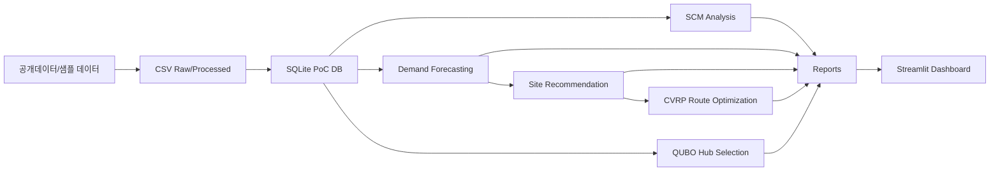

# Architecture

## 데이터 계층

- `data/raw/`: 실제 공개데이터 파일을 넣는 위치
- `data/processed/`: 샘플 생성 또는 정규화된 CSV
- `data/parcelflow.sqlite`: PoC용 SQLite DB
- `outputs/`: 분석/모델/추천/최적화 산출물
- `models/`: 학습된 모델 artifact

## 운영 확장안

PoC 단계에서는 SQLite를 사용합니다. 포트폴리오 고도화 단계에서는 PostgreSQL + PostGIS + dbt로 전환하면 됩니다.
