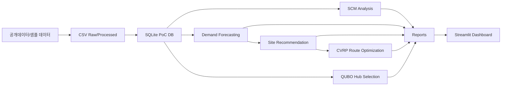

# Architecture

## 데이터 계층

- `data/raw/`: 실제 공개데이터 파일을 넣는 위치
- `data/processed/`: 샘플 생성 또는 정규화된 CSV
- `data/parcelflow.sqlite`: PoC용 SQLite DB
- `outputs/`: 분석/모델/추천/최적화 산출물
- `models/`: 학습된 모델 artifact

## 운영 확장안

PoC 단계에서는 SQLite를 사용합니다. 포트폴리오 고도화 단계에서는 PostgreSQL + PostGIS + dbt로 전환하면 됩니다.

## 파이프라인 신뢰성 보강

- `scripts/run_pipeline.py`는 `_safe_stage`를 사용해 일부 단계를 보호합니다.
- 핵심 산출물 단계에는 `_require_stage` 검증을 적용해, 필요한 파일이 생성되지 않으면 즉시 실패하도록 구성합니다.
- 실패 메시지는 다음 행동(로그 확인 후 재실행)을 안내합니다.

## 분석 케이스 출처 구분

- `outputs/analysis_cases/*.csv`에는 `metric_source` 컬럼이 포함됩니다.
- 이를 통해 지표가 다음 중 어디에서 파생되었는지 구분할 수 있습니다.
  - simulation output 기반
  - forecasting / recommender / optimization output 기반
  - rule-based 파생 지표
